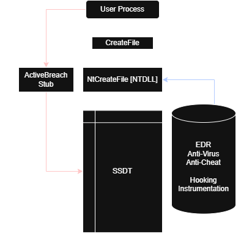
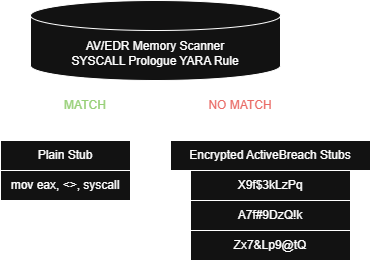
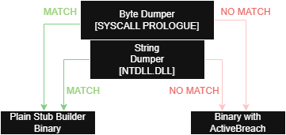

## ActiveBreach Engine

ABE aspires to be SysWhispers & Hell’s Gate Successor. It takes the concepts used and turns it into a fully functional framework.

Originally inspired by a blogpost by [MDSEC](https://www.mdsec.co.uk/2020/12/bypassing-user-mode-hooks-and-direct-invocation-of-system-calls-for-red-teams/).

---

### What does ActiveBreach do differently?

Common syscall frameworks like **SysWhispers** and **Hell's Gate** provide static wrappers or inject precompiled stubs to provide direct system call execution. While effective, these approaches leave much room for improvement and do not address critical security vulnerabilites and detection mechanisms that can be used to detect such methods.

Several limitations are common across these tools:

* Binaries containing ``syscall`` instructions or ABI's are a very clear heuristic detection
* Processes running with RWX/WCX/WX/X regions containing ``syscall`` ABI are obvious to common AV/EDR YARA scans (C/C++ ABE does not fix this, Rust does)
* Syscalls executed from non-system threads raise suspicion
* Syscalls executed from non-image-backed RWX/WCX/WX/X regions raise suspicion
* ``ntdll.dll`` or ``Nt*Api`` strings present in a binary raises heuristics
* Recursive GetProcAddr raises heuristics
* Mapping in-memory ``ntdll.dll`` indirectly calls AV/EDR hooks and triggers heuristics
* LoadLibrary *(Especially ``ntdll.dll``)* raises heuristics

---

### How ActiveBreach Works

ABE works around *most* of these constraints, with the rust version offering the most advanced implementation.

From stringless ``ntdll.dll`` loading, in-memory execution and page protection flipping & encryption, ABE makes use of more thought-out and revamped concepts.

I'm not going to go through all the workarounds ABE uses as there's so many of them, I encourage you to look at the code to see for yourself.

ABE also introduces these helpers (On C++ version)

* **Anti-Tamper instrumentation**, which validates thread state, PEB/TEB integrity, and call origins
* **Debugging & symbolic tracing**, optionally enabled via `AB_DEBUG`, allowing runtime inspection of syscall arguments, return values, and violation counters

---

### Versions

There's 3 versions of ABE, select based on what you're looking for.

* C - Minimal basic implementation, small footprint
* C++ - Larger footprint, uses C++ 17/20, includes Anti-Tamper & Debugging
* Rust - Largest, most advanced, includes JIT-memory-encryption & is truly stringless

### Test Coverage

For C & C++, they can be found in the solution *(.sln)*.

For Rust, it can be found in ``/tests/``

---

### Example: Hooked API Flow vs ActiveBreach

 

---

## Usage
See [USAGE.md](USAGE.md) for full setup & examples in **C, C++ & Rust**.

---

## License

**Creative Commons Attribution-NonCommercial 4.0 International (CC BY-NC 4.0)**  

[Full License](https://creativecommons.org/licenses/by-nc/4.0/)

---

## Disclaimer
This tool is for educational and research use only. Use at your own risk. You are solely responsible for how you use this code.
