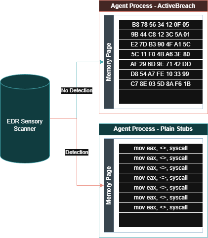
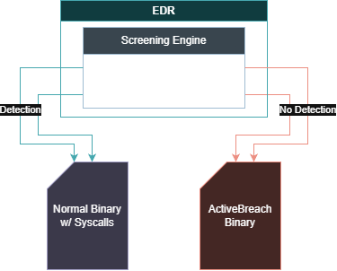

# ActiveBreach Engine (ABE)

**ActiveBreach** is a fully dynamic direct syscall framework for Windows 10/11 x64, designed as a modern successor to tools like SysWhispers and Hell's Gate.

Inspired by [MDSEC's research on bypassing user-mode hooks](https://www.mdsec.co.uk/2020/12/bypassing-user-mode-hooks-and-direct-invocation-of-system-calls-for-red-teams/).

ABE addresses key detection vectors that affect traditional syscall stubs:

- Static `syscall` patterns and RWX regions
- Suspicious call stacks and non-backed execution
- Hooked API usage during SSN resolution
- String and import heuristics

The **Rust implementation** is the most advanced, featuring JIT memory encryption, full stringless design, and rotating encrypted stubs.

## Feature Comparison

| Feature                        | C          | C++                  | Rust (Recommended)          |
|-------------------------------|------------|----------------------|-----------------------------|
| Dynamic SSN extraction        | Yes        | Yes                  | Yes                         |
| Clean ntdll mapping           | Yes        | Yes                  | Yes                         |
| Encrypted rotating stubs      | No         | No                   | Yes (LEA-based, runtime key)|
| Stack spoofing                | Basic      | Yes                  | Yes (Sidewinder profiles)   |
| Usermode-only dispatch        | Yes        | Yes                  | Yes                         |
| Anti-tamper / debugging       | No         | Yes (optional)       | No                          |
| Stringless binary             | Partial    | Partial              | Full                        |
| Footprint                     | Smallest   | Medium               | Largest                     |
| YARA / memory scan resistance | Low        | Medium               | Highest                     |

## How It Works

ABE extracts SSNs at runtime from a privately mapped clean `ntdll.dll`, builds minimal stubs, and executes syscalls via a dedicated dispatcher thread.

Key evasion techniques (Rust version):

- Stubs are encrypted at rest with a hardware-derived LEA variant
- Ring-buffer rotation + in-place decrypt/encrypt
- Per-category stack spoofing for realistic return chains
- No kernel sync objects for queuing (usermode `WaitOnAddress`/`WakeByAddress`)
- Zero reliance on hooked Windows APIs

### Visual Overview

- **Hooking Bypass**: 
- **Dynamic Memory Evasion**: 
- **Static Analysis Evasion**: 

For a deep dive, read the source; the techniques are heavily commented.

## Usage

See [USAGE.md](USAGE.md) for:

- Build instructions (MSVC toolchains, Windows 10/11 x64 AMD)
- Integration examples in C, C++, and Rust
- Test suite execution

## Testing

- **C / C++**: Visual Studio solution (`.sln`) with test projects
- **Rust**: `cargo test` in `/tests/`

## Disclaimer

This tool is provided for **educational and authorized security research only**.  
Unauthorized use may violate laws. The authors and contributors assume no liability.

## License

Copyright © 2025 TITAN Softwork Solutions

Licensed under the Apache License, Version 2.0 (the "License") **with the Commons Clause License Condition v1.0**.

- You may not use this software for commercial purposes ("Sell the Software" as defined in the Commons Clause).
- Full text is provided in `LICENSE`.

Apache 2.0: <http://www.apache.org/licenses/LICENSE-2.0>  
Commons Clause details: <https://commonsclause.com/>

## Contributing

Pull requests welcome. Focus areas:

- New evasion techniques
- Additional syscall coverage
- Performance improvements (especially Rust stub ring)

Please document changes clearly and retain the required license notices.
